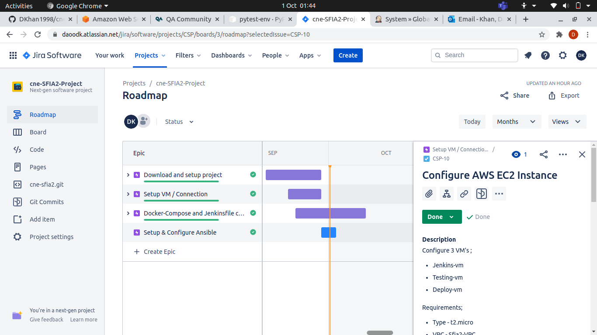
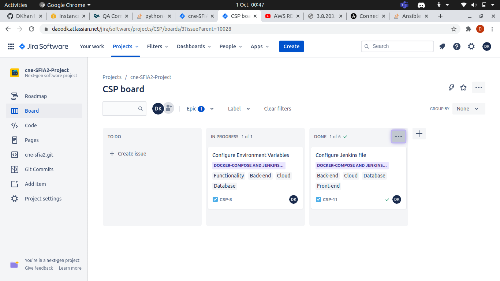
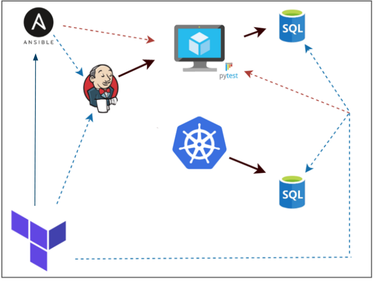
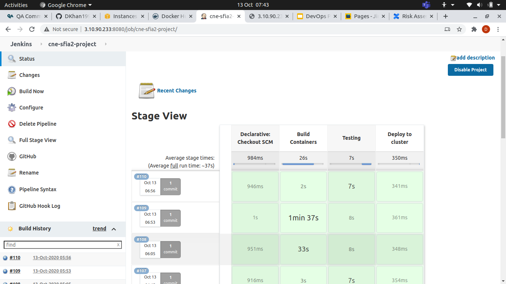
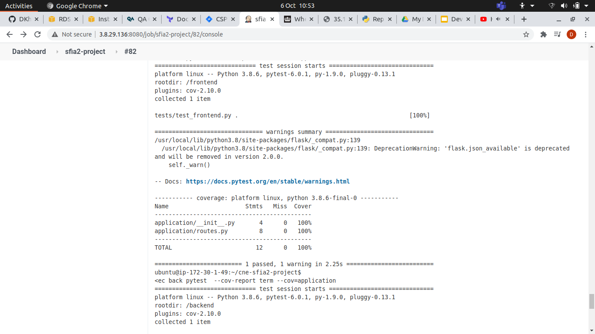
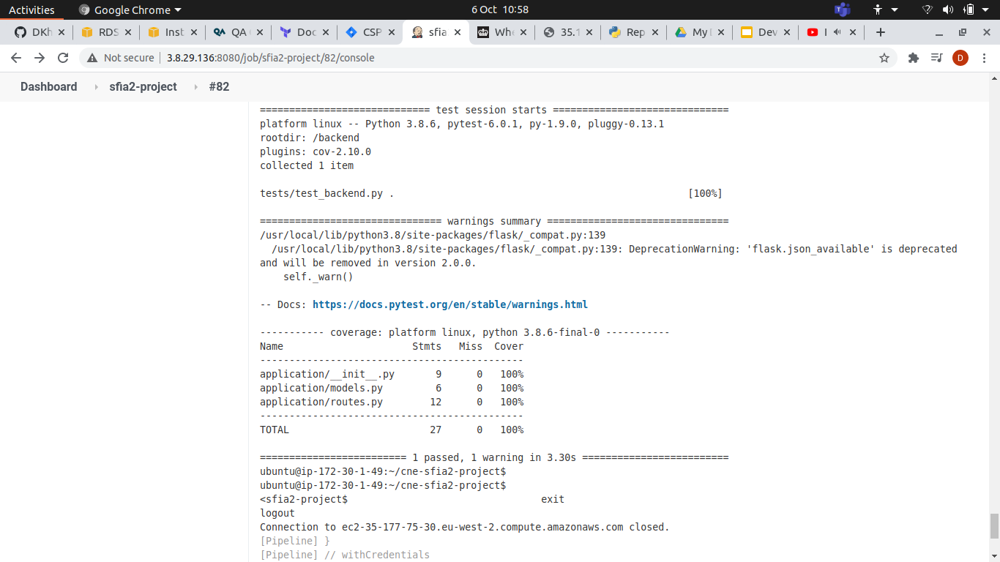
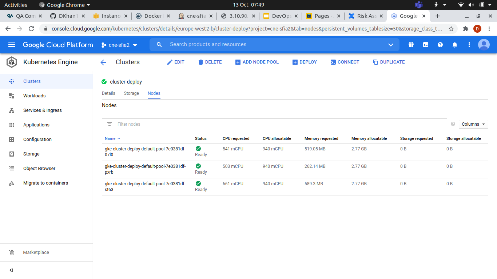
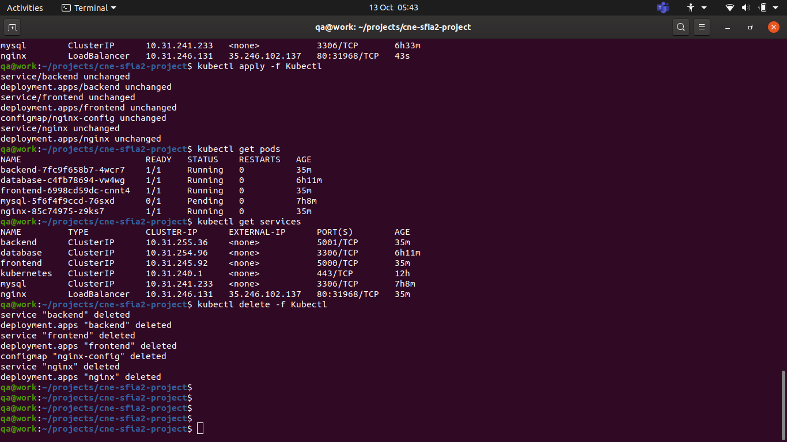

x# QAC SFIA2 Project

The application is a simple Flask application, built in Python, that makes use of a microservice architecture comprising of 2 separate services.

## Brief

The application must:

- Be deployed to a **Virtual Machine for testing**
- Be deployed in a **managed Kubernetes Cluster for production**
- Make use of a **managed Database solution**

## Application

The application works by:
1. The frontend service making a GET request to the backend service. 
2. The backend service using a database connection to query the database and return a result.
3. The frontend service serving up a simple HTML (`index.html`) to display the result.

### Constraints

1. Kanban Board: Jira
2. Version Control: Git
3. CI Server: Jenkins
4. Configuration Management: Ansible
5. Cloud Server: AWS EC2
6. Database Server: AWS RDS
7. Containerisation: Docker
8. Reverse Proxy: NGINX
9. Orchestration Tool: Kubernetes
10. Infrastructure Management: Terraform

### Project Planning

## MOSCOW Analysis

## Risk Assessment

## JIRA Board

### Continuous Integration

The project infrastructure follows this design
*   Terraform builds resources
*   Ansible configures them
*   Jenkins builds application
*   Jenkins Runs test in py-environmnet
*   Test application using a testdb
*   Manually deploy project images to docker hub
*   Manually run kurbenetes deployment configured to run on deploydb

## Jenkins

## Testing

Pytest is done using the python interpreter in pytest, where jenkins will assign a testdb vm to build and test the project.

The following screenshots represent the test scenarios;

## Kubernetes

We run Kubernetes manually as we lack configuration to run independently through jenkins and terraform

